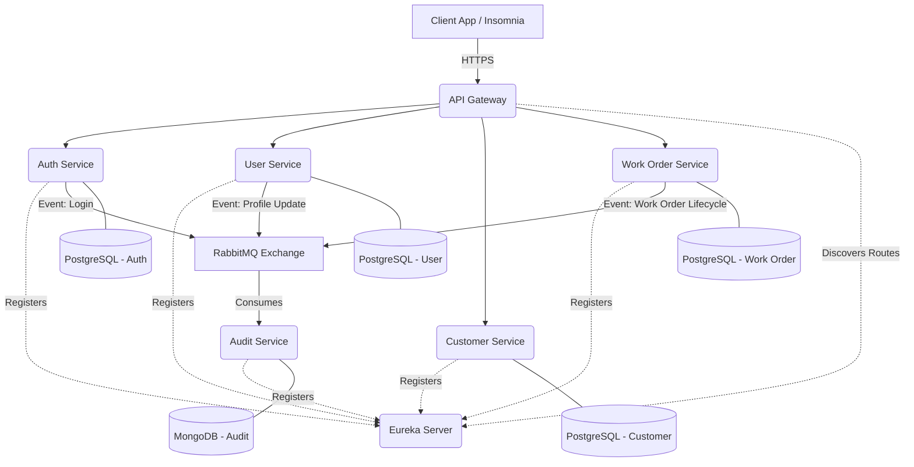

# Field Service Management (FSM) Platform - Microservices Architecture


A production-ready, distributed backend system designed to power Field Service operations (such as Telecommunications, ISPs, HVAC, and Utility companies). 

Built using a **Microservices Architecture**, this project focuses on high availability, scalability, and robust security, serving as a comprehensive showcase of modern Backend Engineering practices.

## 🎯 Purpose & Problem Solved
Field Service operations are inherently complex. They involve managing hundreds of technicians, scheduling thousands of work orders, handling real-time status updates, and tracking customer data—often resulting in massive, unmaintainable monolithic applications.

This project solves these challenges by breaking the system down into decoupled, independently deployable microservices. 
- **Scalability:** The authentication and scheduling engines can scale independently during peak hours.
- **Resilience:** If the Audit Service goes down, the core system continues to function thanks to asynchronous event-driven communication via RabbitMQ.
- **Polyglot Persistence:** Transactional data (Users, Work Orders) is safely stored in PostgreSQL, while flexible, high-volume event logs are stored in MongoDB.

## 🏗️ Architecture
The ecosystem currently consists of **7 distinct microservices**, securely hidden behind an API Gateway and orchestrated by a Service Registry.



## 🧩 Microservices Overview

| Service | Port | Description | Database |
|---------|------|-------------|----------|
| **API Gateway** | `8080` | The single entry point for all clients. Uses Spring Cloud Gateway (Reactive) to route requests, validate JWTs, and inject security headers into downstream services. | N/A |
| **Eureka Server** | `8761` | Service Registry. All microservices register themselves here, allowing the Gateway to dynamically discover and route traffic without hardcoded IPs. | N/A |
| **Auth Service** | `8081` | Manages authentication, JWT generation, and Role-Based Access Control (RBAC). Supports traditional passwords, Device IDs, and NFC logins. | PostgreSQL |
| **User Service** | `8082` | Manages user profiles (Technicians, Admins, Customers). Uses OpenFeign for synchronous communication with the Auth Service when needed. | PostgreSQL |
| **Customer Service** | `8084` | Manages customer data and billing profiles. The foundation for assigning tasks in the field. | PostgreSQL |
| **Work Order Service** | `8085` | The core domain engine linking customers to technicians. Emits lifecycle events (`WORK_ORDER_CREATED`, `COMPLETED`) to the message broker. | PostgreSQL |
| **Audit Service** | `8083` | A purely asynchronous consumer. Listens to RabbitMQ queues for system events (like logins or profile updates) and securely logs them for compliance. | MongoDB |

## 🛠️ Technologies Used
* **Core:** Java 17, Spring Boot 3.4.1, Spring Cloud 2024.0.0
* **Data Access:** Spring Data JPA, Hibernate, Spring Data MongoDB
* **Databases:** PostgreSQL (Relational), MongoDB (NoSQL Document)
* **Messaging:** RabbitMQ (Event-Driven Architecture / AMQP)
* **Security:** Spring Security, JWT (JSON Web Tokens)
* **Routing & Discovery:** Spring Cloud Gateway, Netflix Eureka
* **Testing:** JUnit 5, Mockito, Testcontainers
* **Deployment:** Docker, Docker Compose, Kubernetes (Minikube)

---

## 🚀 How to Run the Project

You can run this project in two different environments: Locally using Docker Compose for simple development, or within a fully orchestrated Kubernetes cluster.

### Option 1: Run with Docker Compose (Local Development)

This is the fastest way to boot up the infrastructure and run the Spring Boot apps natively on your machine via Maven.

1. **Start the Infrastructure (Databases & Message Broker)**
   ```bash
   docker-compose up -d
   ```
2. **Start the Microservices**
   Start the applications in the following order (using separate terminals):
   ```bash
   cd eureka-server && ./mvnw spring-boot:run
   cd api-gateway && ./mvnw spring-boot:run
   cd auth-service && ./mvnw spring-boot:run
   cd user-service && ./mvnw spring-boot:run
   cd customer-service && ./mvnw spring-boot:run
   cd work-order-service && ./mvnw spring-boot:run
   cd audit-service && ./mvnw spring-boot:run
   ```
3. **Access the Application**
   - Eureka Dashboard: `http://localhost:8761`
   - RabbitMQ UI: `http://localhost:15672` (guest/guest)
   - API Gateway: `http://localhost:8080`

---

### Option 2: Run with Kubernetes (Production Simulation)

This project includes fully configured Kubernetes manifests (Deployments, Services, PVCs) for deployment on a local cluster like Minikube.

1. **Start Minikube**
   ```bash
   minikube start --driver=docker
   ```
2. **Build Docker Images**
   Use the provided script to package all microservices into highly optimized Docker images using the Native CLI:
   ```bash
   ./build-all-images.sh
   ```
3. **Load Images into Minikube**
   Since Minikube uses an isolated Docker daemon, you must push the newly built images to its local registry:
   ```bash
   for SERVICE in eureka-server api-gateway auth-service user-service customer-service work-order-service audit-service; do minikube image load fsm/$SERVICE:latest; done
   ```
4. **Deploy Infrastructure & Apps to Kubernetes**
   ```bash
   kubectl apply -f k8s/infra/
   kubectl apply -f k8s/apps/
   ```
5. **Access the Cluster**
   Because Kubernetes uses its own internal networking, you cannot use `localhost`. Ask Minikube to expose the API Gateway endpoint:
   ```bash
   minikube service api-gateway --url
   ```

---

## 🎉 Project Status: Completed
This project has officially reached its primary architectural milestones. It successfully demonstrates a complete migration from a theoretical monolithic structure into a fully functional, containerized, and orchestrated Microservices environment.

**Completed Milestones:**
- [x] **Event-Driven Architecture:** Asynchronous communication via RabbitMQ.
- [x] **Polyglot Persistence:** Utilizing PostgreSQL and MongoDB based on domain requirements.
- [x] **Customer & Work Order Domains:** Core engines linking clients to field technicians.
- [x] **Integration Tests:** Leveraging Testcontainers for robust, production-like testing.
- [x] **Kubernetes Migration:** Moving from Docker Compose to a fully orchestrated K8s deployment using Deployments, Services, and Persistent Volumes.

---

## 🔮 Future Enhancements
While the core system is fully operational, the architecture is designed to easily support the following enhancements in the future:
- **CI/CD Pipeline:** Automating testing and deployment using GitHub Actions.
- **Resilience Engineering:** Implementing Resilience4j (Circuit Breakers & Retries) for enhanced inter-service stability.
- **Distributed Tracing:** Integrating Micrometer and Zipkin for end-to-end observability across all 7 microservices.