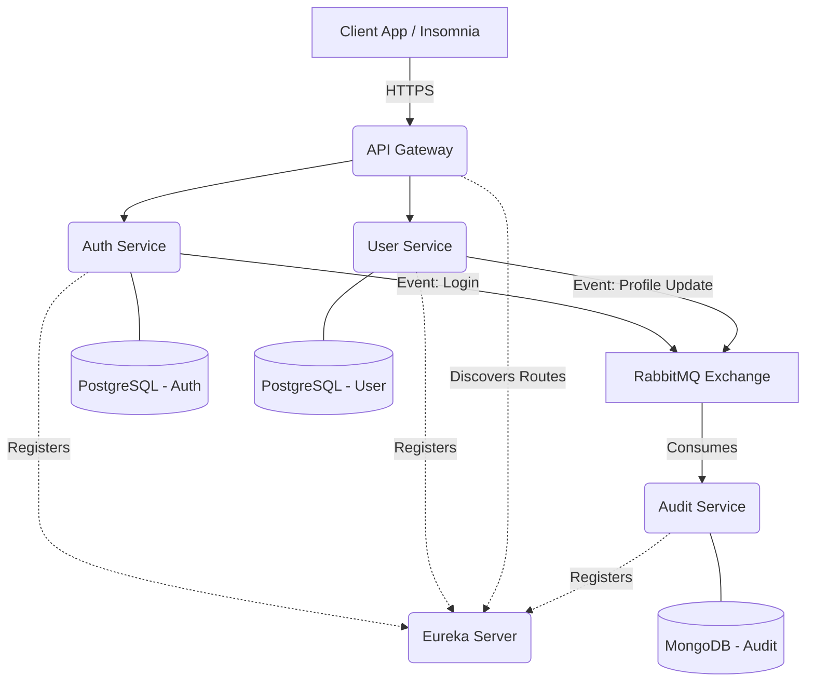

# Field Service Management (FSM) Platform - Microservices Architecture


A production-ready, distributed backend system designed to power Field Service operations (such as Telecommunications, ISPs, HVAC, and Utility companies). 

Built using a **Microservices Architecture**, this project focuses on high availability, scalability, and robust security, serving as a comprehensive showcase of modern Backend Engineering practices.

## 🎯 Purpose & Problem Solved
Field Service operations are inherently complex. They involve managing hundreds of technicians, scheduling thousands of work orders, handling real-time status updates, and tracking customer data—often resulting in massive, unmaintainable monolithic applications.

This project solves these challenges by breaking the system down into decoupled, independently deployable microservices. 
- **Scalability:** The authentication and scheduling engines can scale independently during peak hours.
- **Resilience:** If the Audit Service goes down, the core system continues to function thanks to asynchronous event-driven communication via RabbitMQ.
- **Polyglot Persistence:** Transactional data (Users, Work Orders) is safely stored in PostgreSQL, while flexible, high-volume event logs are stored in MongoDB.

## 🏗️ Architecture
The ecosystem currently consists of **5 distinct microservices**, securely hidden behind an API Gateway and orchestrated by a Service Registry.



## 🧩 Microservices Overview

| Service | Port | Description | Database |
|---------|------|-------------|----------|
| **API Gateway** | `8080` | The single entry point for all clients. Uses Spring Cloud Gateway (Reactive) to route requests, validate JWTs, and inject security headers into downstream services. | N/A |
| **Eureka Server** | `8761` | Service Registry. All microservices register themselves here, allowing the Gateway to dynamically discover and route traffic without hardcoded IPs. | N/A |
| **Auth Service** | `8081` | Manages authentication, JWT generation, and Role-Based Access Control (RBAC). Supports traditional passwords, Device IDs, and NFC logins. | PostgreSQL |
| **User Service** | `8082` | Manages user profiles (Technicians, Admins, Customers). Uses OpenFeign for synchronous communication with the Auth Service when needed. | PostgreSQL |
| **Audit Service** | `8083` | A purely asynchronous consumer. Listens to RabbitMQ queues for system events (like logins or profile updates) and securely logs them for compliance. | MongoDB |

## 🛠️ Technologies Used
* **Core:** Java 17, Spring Boot 3.4.1, Spring Cloud 2024.0.0
* **Data Access:** Spring Data JPA, Hibernate, Spring Data MongoDB
* **Databases:** PostgreSQL (Relational), MongoDB (NoSQL Document)
* **Messaging:** RabbitMQ (Event-Driven Architecture / AMQP)
* **Security:** Spring Security, JWT (JSON Web Tokens)
* **Routing & Discovery:** Spring Cloud Gateway, Netflix Eureka
* **Database Migrations:** Flyway
* **Infrastructure:** Docker, Docker Compose

## 🚀 How to Run Locally

### Prerequisites
- Docker & Docker Compose
- Java 17
- Maven (or use the provided `./mvnw` wrapper)

### 1. Start the Infrastructure (Databases & Message Broker)
The project includes a `docker-compose.yml` that provisions PostgreSQL, MongoDB, and RabbitMQ.
```bash
docker-compose up -d
```
*(Note: The `user-service` requires a database named `fsm_user`. If it is not created automatically by Docker, you can create it manually via `psql` using the `fsm_user` credentials).*

### 2. Start the Microservices
Start the applications in the following order to ensure proper registration:
1. **Eureka Server:** `cd eureka-server && ./mvnw spring-boot:run`
2. **API Gateway:** `cd api-gateway && ./mvnw spring-boot:run`
3. **Auth Service:** `cd auth-service && ./mvnw spring-boot:run`
4. **User Service:** `cd user-service && ./mvnw spring-boot:run`
5. **Audit Service:** `cd audit-service && ./mvnw spring-boot:run`

### 3. Access the Application
- Eureka Dashboard: `http://localhost:8761`
- RabbitMQ Management UI: `http://localhost:15672` (guest/guest)
- API Gateway (Client Entrypoint): `http://localhost:8080`

## 🗺️ Roadmap / Next Steps
This project is continuously evolving. The next planned milestones are:
- [ ] **Customer Service:** Managing the clients who request the services.
- [ ] **Work Order Service:** The core domain engine linking customers to technicians.
- [ ] **Resilience:** Implementing Resilience4j (Circuit Breakers & Retries) for inter-service stability.
- [ ] **Distributed Tracing:** Integrating Micrometer and Zipkin for end-to-end observability.
- [ ] **Kubernetes:** Migrating from Docker Compose to a fully orchestrated K8s deployment.